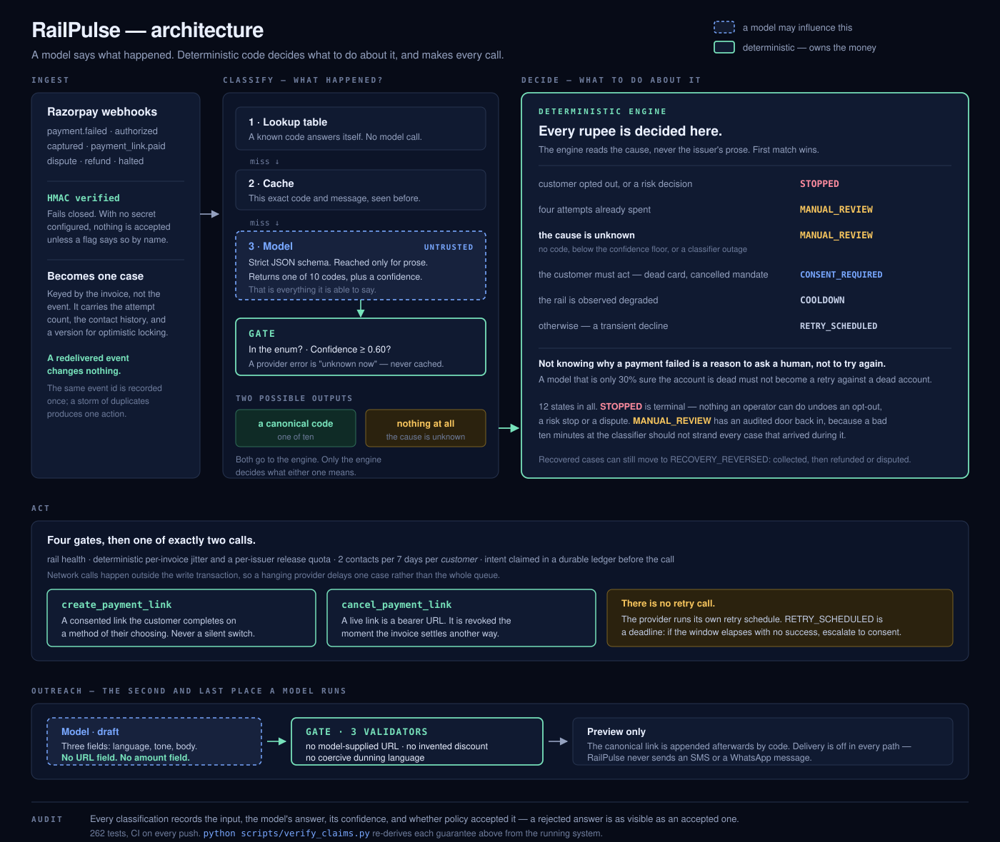

# RailPulse

**A containment layer for letting a model near money — demonstrated on failed subscription recovery.**

Razorpay AI Buildathon · Track 03: AI Revenue Recovery

---

Twelve independent worlds, 500 failed payments each, against the strongest
baseline a merchant actually runs today:

> ### +₹66,409 net recovered per 500 payments
> 95% CI +₹43,757 – +₹89,061 · **won 12 of 12 worlds** · **0 customers opted
> out**, against that baseline's 217 (a mean of 216.9 across the twelve worlds).
>
> Take the AI out and the same engine **loses** to plain retry-with-backoff.
> Classification is worth **+₹183,070** [+₹163,192 – +₹202,948], 12/12.

```bash
python -m app.sim.report    # reproduces every number below in ~30s, no API key
```



*A model says what happened. Deterministic code decides what to do about it, and makes
every call. Two model surfaces, each behind a gate; everything that moves money is a
state machine.*

Now the part that decides whether any of that means anything.

## What it claims, and what it doesn't

RailPulse recovers failed recurring payments by deciding, for each one, whether
to wait, retry, ask the customer for a fresh consented authorisation, or stop —
and it measures that decision against what merchants actually do today.

**The honest version first**, because everything below depends on it:

These numbers come from a **synthetic world, not merchant data**. The claim is a
*controlled comparison between policies under identical conditions* — not a
forecast of what any real merchant would recover. What makes the comparison
worth anything is that the world holds a recovery function no policy can read,
and every policy faces a byte-identical copy of it for a given seed.

Two earlier versions of this measurement were wrong, in ways worth stating
because they are the failure modes this kind of benchmark invites:

- The first drew each policy's outcome from a probability assigned to that
  policy in advance. RailPulse "won" because a constant said it would. It was
  rebuilt from scratch.
- The second was honest but ran **one seed** and quoted the result to the rupee.
  Several of the gaps it printed were narrower than the seed-to-seed standard
  deviation. Every figure below is now a mean over twelve seeds with a 95%
  confidence interval, and every comparison is paired.

[Measurement](#how-the-measurement-works) explains how both were fixed.

## Results

500 payments per world, twelve seeds. `python -m app.sim.report` reproduces
every number on this page in about 30 seconds, with no API key.

### Default world

| policy | mean net recovered | 95% CI | recovery rate | attempts/rec | contacts/rec | opt-outs |
|---|---:|---:|---:|---:|---:|---:|
| do-nothing | ₹349,845 | ₹326,773 – ₹372,917 | 26.9% ± 1.4 | 0.00 | 0.00 | 0 |
| retry-3x-immediate | ₹480,606 | ₹460,316 – ₹500,895 | 37.4% ± 1.2 | 7.57 | 0.00 | 0 |
| retry-3x-backoff | ₹598,905 | ₹569,994 – ₹627,816 | 46.2% ± 2.0 | 5.71 | 0.00 | 0 |
| static-dunning | ₹607,419 | ₹581,023 – ₹633,816 | 47.0% ± 1.8 | 2.14 | 5.90 | **216.9** |
| railpulse (no classifier) | ₹490,758 | ₹468,461 – ₹513,056 | 37.6% ± 1.4 | 1.08 | 0.35 | 0 |
| **railpulse + classifier** | **₹673,828** | ₹652,215 – ₹695,442 | **52.5% ± 1.8** | 2.06 | 0.75 | **0** |

### Second world

Shifted parameters: harsher failure mix, less patient customers, slower natural
recovery. Calling it "held-out" would overstate it — I wrote it, and I wrote it
at the same time as the default world, so it is a robustness check rather than
an independent test set. What it establishes is that the ordering is not an
artefact of one particular set of constants. What it cannot establish is that
the ordering is not an artefact of my assumptions about how recovery behaves.
Those are different claims and only the first is being made.

| policy | mean net recovered | 95% CI | recovery rate | attempts/rec | contacts/rec | opt-outs |
|---|---:|---:|---:|---:|---:|---:|
| do-nothing | ₹298,869 | ₹281,335 – ₹316,403 | 23.2% ± 1.4 | 0.00 | 0.00 | 0 |
| retry-3x-immediate | ₹403,281 | ₹382,378 – ₹424,184 | 30.7% ± 1.4 | 9.32 | 0.00 | 0 |
| retry-3x-backoff | ₹490,446 | ₹467,450 – ₹513,441 | 37.5% ± 1.3 | 7.26 | 0.00 | 0 |
| static-dunning | ₹354,201 | ₹338,824 – ₹369,579 | 26.9% ± 1.2 | 3.73 | 9.97 | **336.5** |
| railpulse (no classifier) | ₹408,653 | ₹394,518 – ₹422,788 | 31.6% ± 1.2 | 0.93 | 0.62 | 0 |
| **railpulse + classifier** | **₹560,152** | ₹538,988 – ₹581,317 | **42.5% ± 1.3** | 1.85 | 1.27 | **0** |

### The comparison those tables cannot make

Per-policy intervals overlap, and reading a winner off two overlapping intervals
is a mistake. Because every policy faces an identical world for a given seed,
the statistic that answers "does this actually beat that" is the **per-seed
difference**:

| paired difference in net recovered | mean Δ | 95% CI | seeds won |
|---|---:|---:|---:|
| **default world** | | | |
| vs do-nothing | +₹323,984 | +₹299,590 – +₹348,378 | 12/12 |
| vs retry-3x-immediate | +₹193,223 | +₹166,679 – +₹219,766 | 12/12 |
| vs retry-3x-backoff | +₹74,923 | +₹54,880 – +₹94,967 | 12/12 |
| vs static-dunning | +₹66,409 | +₹43,757 – +₹89,061 | 12/12 |
| vs railpulse without a classifier | +₹183,070 | +₹163,192 – +₹202,948 | 12/12 |
| **second world** | | | |
| vs do-nothing | +₹261,283 | +₹229,002 – +₹293,565 | 12/12 |
| vs retry-3x-immediate | +₹156,872 | +₹129,736 – +₹184,007 | 12/12 |
| vs retry-3x-backoff | +₹69,707 | +₹46,535 – +₹92,879 | 12/12 |
| vs static-dunning | +₹205,951 | +₹182,100 – +₹229,802 | 12/12 |
| vs railpulse without a classifier | +₹151,499 | +₹127,976 – +₹175,023 | 12/12 |

Every interval excludes zero and every comparison is 12/12. When one is not, the
report prints `NOT RESOLVED` beside it in words rather than letting a mean read
as a win — see `render_paired` in `app/sim/multiseed.py`.

### Four things worth reading off these tables

**26.9% recovers with no intervention at all.** That is the number most uplift
claims quietly absorb into their own. Every figure here is stated against it.
Getting the anchor right took a bug fix of its own — see
[the do-nothing anchor](#the-do-nothing-anchor-was-a-polling-artefact).

**Static dunning buys its rupees by destroying the customer base.** On the
default world it lands within ₹67k of RailPulse — and permanently loses a mean
of **217 of 500 customers** to opt-out doing it, at 5.90 contacts per recovery. On the
second world, where customers are less patient, the same strategy collapses to
26.9% and burns 337. Aggressive contact is not just rude, it is *fragile*.
RailPulse loses **zero** customers on either world.

That column is not priced into net recovered, which means the rupee figure
**flatters static dunning**: it books the revenue and none of the cost of the
customers it burned to earn it. The comparison is left unfavourable to RailPulse
rather than corrected with a churn number I would have to invent.

**RailPulse recovers more with a fraction of the retries.** On the second
world it takes 1.85 attempts per recovery against backoff's 7.26 — 75% fewer —
while recovering ₹69,707 more, because it can tell a dead instrument from a
temporary decline instead of hammering both. Retry pricing here is a flat
per-attempt fee and does *not* model card-scheme excessive-retry penalties,
which would widen this further.

**Without the classifier, RailPulse loses to plain 3x-backoff on both worlds.**
₹490,758 against ₹598,905, and ₹408,653 against ₹490,446. That result is left in
the table rather than tuned away, because it is the clearest statement of what
the model is actually for — and it is the subject of the next section.

## The AI's job is deliberately small. That is the design.

The obvious way to put a model into payments recovery is to let it *decide*:
choose the retry time, choose the rail, choose who to chase and how hard. Every
one of those moves money, and none of them can be delegated to something whose
output space is unbounded. A model that can emit any string can emit a retry
against a closed account, and no amount of prompt engineering turns that into a
guarantee.

So RailPulse gives the model exactly one job — **normalising messy issuer text
into a canonical failure code** — and gives it no others. It proposes one member
of a closed enum with a confidence; deterministic code decides what that label
means. Every state transition that moves money is a state machine, not a
completion. When the model is unsure, the case goes to a human rather than to a
retry.

The objection writes itself: if the model only labels things, is it doing
anything? That is a measurable question, so it is measured.

### The ablation

The two RailPulse rows differ in exactly one thing: whether a classifier sits in
front of the engine. Same state machine, same guardrails, same worlds, same
seeds.

With no classifier, a third of payments arrive with **no failure code**, only
prose. That fraction is the simulator's, chosen as a plausible stand-in for
real acquirer traffic — I have no merchant data to source a real one from, and
an earlier draft of this README asserted it about the real world, which it had
no business doing. The engine classifies those as `UNKNOWN`, and its policy for
`UNKNOWN` is to stop deciding and ask a human. On a 500-case world that parks a
mean of **258 cases in `MANUAL_REVIEW`** (range 240–273 across the twelve
seeds) — over half the book — and recovery sits at 37.6%, below plain
retry-with-backoff.

That is correct behaviour, and it is also expensive. The engine is refusing to
guess about money, which is exactly what it should do; the classifier is what
gives it something to not-guess about. Restoring it moves recovery to 52.5% and
`MANUAL_REVIEW` down to a mean of 98 (range 85–126).

**+₹183,070 [+₹163,192, +₹202,948], 12/12 seeds.** That is the measured value of
classification in this system, isolated by ablation on identical worlds — not
inferred from the gap to a baseline that differs in five ways at once.

### Why not just write more rules?

The repo ships a keyword classifier as the floor, and it looks excellent:
**92.6%** accuracy at 96.6% coverage on the simulator's own messages. That number
is close to meaningless — the rules were written against the strings the
simulator emits.

So both are scored on 24 phrasings that appear **nowhere** in the simulator —
`Balance kam hai`, `UMN not found at NPCI`, `velocity check breach`,
`remitter bank offline`, `validity period over`:

| | coverage | accuracy over all cases | dangerous confusions |
|---|---:|---:|---:|
| keyword rules | 33.3% | **8.3%** | 2 |
| `gpt-4.1-mini` | **100%** | **91.7%** | **0** |

Eleven times the accuracy, three times the coverage, and — the part that
matters more for a payments system — **zero dangerous confusions** against the
rules' two.

> **Provenance.** The keyword row comes out of every run of the report. The
> model row does not — it costs an API call per phrasing — so the run it came
> from is committed rather than asserted:
> **[`docs/live-model-run.txt`](docs/live-model-run.txt)**, recorded 2026-08-25
> at commit `1b77124`. 24 phrasings, 24 model calls, 24 accepted, 22 correct.
>
> `app/classifier.py` and `app/sim/classifier_eval.py` have not been touched
> since that commit, so it is the same measurement the code would make today —
> `git log --oneline app/classifier.py app/sim/classifier_eval.py` is the check.
> The file's header marks which of its other sections are superseded, because
> its policy tables predate the multi-seed rewrite and every one of their
> numbers has since moved. `export OPENAI_API_KEY=... && python -m
> app.sim.report` regenerates the whole thing in about a minute.

A *dangerous confusion* means calling a dead card "insufficient funds" and
triggering a retry storm against an instrument that will never clear, or
misreading a fraud block as something retryable. It is scored separately from
accuracy because those two errors do not cost the same.

Real acquirers invent new phrasings constantly: new banks, new switches,
Hinglish, typos, internal error codes. Generalising to text nobody wrote a rule
for is the entire job — and it is why the ablation above is run against the
**keyword floor** rather than the model. **Every rupee figure on this page is
achievable with a rule table.** The model's contribution is that the same
figures survive contact with text the rule table has never seen. Attributing the
rupees themselves to the LLM would be an overclaim.

### Scored on Razorpay's own vocabulary

Everything above is measured against text I wrote. That is a ceiling on what
any of it can prove — a classifier evaluated on its author's prose is being
asked whether it can read its author's mind.

So it is also scored on **22 (code, description) pairs copied verbatim from
Razorpay's public error documentation**: real provider text, written by people
who have never seen this codebase, in the exact vocabulary a merchant
integrating with Razorpay actually receives.

| keyword rules | coverage | accuracy over all cases | dangerous confusions |
|---|---:|---:|---:|
| code present, as a webhook carries it | 36.4% | **31.8%** | 0 |
| code withheld, prose only | 9.1% | **9.1%** | 0 |

A rule table meeting somebody else's vocabulary answers a third of it and
refuses the rest — which is the *correct* failure mode, and also why the model
is there. Strip the code and it has almost nothing left to match on.

> Run `python -m app.sim.report` with a key for the model's rows. The section
> prints both modes.

**What this establishes, and what it does not.** The strings are real. The
`cause` labels are mine — Razorpay publishes the code and the description, not
a mapping onto this system's seven recovery causes — so the mappings are kept
deliberately literal and every contestable case is *excluded* rather than
argued for. All eight exclusions are listed with reasons in
[`app/sim/razorpay_corpus.py`](app/sim/razorpay_corpus.py), and each reason is
about the label, never about the answer. It is also a vocabulary rather than a
distribution: real traffic is dominated by a handful of these codes and this
set weights them equally. This is the strongest evaluation available without a
merchant's data, and it is still not a merchant's data.

`tests/test_razorpay_corpus.py` asserts the corpus never overlaps the
simulator's own message table — by equality and by substring — because the
moment it does, it is measuring memorisation again.

### The second surface: drafting

Classification is one of two places a model touches this system. The other is
outreach copy — and it is worth separating, because the containment argument
looks different when the model is *generating* text a customer will read
rather than labelling text a machine will act on.

The guarantee here is structural rather than instructional. The draft schema
has three fields: language, tone, message body. There is **no field for a URL
and no field for an amount**, so a model cannot supply either regardless of
what it is asked to do — a jailbreak has nowhere to put the payload. Whatever
it does return still passes three validators it cannot reach from inside a
prompt (no URLs, no invented discounts, no coercive dunning), the canonical
link is appended afterwards by code, and delivery is off in every path.

A provider that times out or returns nonsense degrades to the template rather
than failing the merchant's request. `tests/test_draft_provider.py` drives a
jailbroken provider that returns a fake payment URL, an invented 20% discount
and a suspension threat, and asserts all three are refused.

So the model writes the sentence, and code owns every part of it that could
cost anyone money.

### What constrains the model

| Guard | Behaviour |
|---|---|
| Structured output | Forced tool call / strict JSON schema. One member of a closed enum plus a confidence. |
| Invented category | Fails validation, discarded. Not a new category to learn — a malformed answer. |
| Prompt injection in issuer text | Cannot widen the vocabulary. The answer still has to be in the enum. |
| Confidence floor | Below 0.60 the answer is dropped and the case goes to `MANUAL_REVIEW`. Guessing is worse than admitting ignorance when the consequence is a retry against a dead card. |
| Provider outage | Returns "unknown now", never cached as a verdict. An unreachable API must not poison every later occurrence. |
| Audit | Every classification records input, model answer, confidence, and whether policy accepted it. A rejected answer is as visible as an accepted one. |

All six are tested in `tests/test_classifier.py`.

Codes the lookup already recognises never reach the model at all — a lookup is
auditable, free, and cannot hallucinate. The model is the fallback for prose,
not the front door.

## How the measurement works

This is the part that makes the rest credible.

`app/sim/world.py` holds a **latent recovery function**. Each payment carries
ground truth the policy cannot see: when the customer becomes solvent relative to
payday, when the issuer's outage clears, whether a different instrument would
have worked, whether the account is simply dead. Policies receive an
`Observation` — amount, method, issuer, failure code, raw issuer prose, their own
attempt and contact history — and nothing else.

The contract is enforced structurally, not by convention:

- `Observation` is asserted to carry no latent fields.
- A test greps the policy module for any reference to world internals and fails
  if it finds one.
- Issuer health is never given to a policy, only inferable from failures that
  policy itself observed. Two policies on an identical world must see different
  health, and a policy that attempted nothing must see none.
- Same seed → byte-identical world for every policy.

RailPulse is scored by driving the **real `RecoveryService`** through that
world — same store, same health monitor, same state machine that serves the API,
fed genuine `PaymentEvent` webhooks. Not a reimplementation. If the engine has a
bug, the scorecard inherits it. `engine_ledger()` cross-checks the world's count
of recoveries against the engine's own store and a test asserts they agree —
because for a while they did not, and the scorecard was reporting ₹88,824 the
engine had never recorded.

**Baselines** (`app/sim/policies.py`): do-nothing, retry-3x-immediate,
retry-3x-backoff, static-dunning. Each is what some real merchant does today.

### Statistics

Twelve seeds; means with 95% confidence intervals from **Student's t**, not the
normal 1.96 — at twelve samples the normal approximation is about 10% too
narrow, which is exactly the direction that makes a report look more certain
than its data.

Comparisons are **paired**: the per-seed difference, not the gap between two
independently-computed averages. `app/sim/multiseed.py` is explicit about how
much that buys here — roughly 15–30% narrower intervals, well short of the
textbook figure, because the policies do not respond to world variation in the
same direction. The real reason to pair is the win count: "won 12 of 12 worlds"
is a sentence you can only write when both policies faced the same twelve worlds.

`tests/test_multiseed.py` checks the interval arithmetic against values worked
out by hand, then asserts the ordering claimed above on both worlds. If a future
change stops RailPulse beating the baselines, CI fails instead of this README
continuing to say otherwise.

**Known modelling limits.** Retry pricing is a flat per-attempt fee. Customer
solvency is a hazard curve around paydays, not a real balance. Opt-outs are
counted but not priced. The world is a hypothesis about how recovery behaves,
written in code where it can be argued with.

## Design

**Consent-gated method switching.** An eMandate or UPI Autopay mandate is bound
to the instrument it was authorised on, so RailPulse never silently charges a
different one. A method switch is expressed as a consented payment link the
customer completes on a method of their choosing. Same decision space, and it
survives the obvious compliance question.

**A generic decline is sticky to the instrument, not the customer.**
`DO_NOT_HONOUR` classifies as `CUSTOMER_ACTION` and routes to a consented link,
because retrying the same card mostly fails again while the same customer on
another method usually clears.

**Contact is a budgeted resource, and the budget belongs to a person.** Two
contacts per 7 days, 24-hour cooldown, opt-out honoured permanently — enforced
per *customer*, not per invoice. Five failed subscriptions for one person used to
produce five messages in the same second, each case correctly believing it had
spent one of its two. The opt-out column is the argument.

**Every action is claimed before it happens — and a failed claim can be retried.**
A durable ledger records intent under a unique key, then the outcome. The key
guarantees the action is *performed* once; it does not mean one attempt at it is
all the system is permitted. That distinction matters most when revoking a
payment link on a collected invoice: the link is a bearer URL, so a cancel that
times out leaves it live and payable on an invoice that is already settled — and
no further webhook is coming for that case.

**Network calls never happen inside a write transaction.** Record the intent,
release the lock, call the provider, persist the outcome. A hanging provider
delays one case rather than every webhook queued behind it.

**Manual review has a door out. Stopped does not.** A case parked for a human can
be returned to the engine by an operator, with a required note, through an
audited endpoint — because `MANUAL_REVIEW` is reached for transient reasons (a
classifier outage makes every code unclassifiable) as readily as permanent ones.
`STOPPED` has no edge back to anything. Opting out, a risk decision and a dispute
all land there, and nothing an operator can do in this system undoes them.

**The copilot drafts, never sends.** Outreach copy is preview-only, with policy
validators the model cannot talk past: no model-supplied URLs, no unapproved
discounts, no coercive dunning language. The canonical payment link is appended
by code, and every preview records which provider wrote it — `template` means
three hardcoded strings, not a model.

That last clause exists because for most of this project's life the answer was
`template` and this README said "the AI copilot" anyway. The seam was there,
the guardrails were real and tested, and the thing they guarded was a
dictionary lookup. `LLMDraftProvider` now fills it.

### State machine

```text
OPEN → CLASSIFIED → [COOLDOWN | RETRY_SCHEDULED | CONSENT_REQUIRED | STOPPED]
COOLDOWN → RETRY_SCHEDULED         (only once the rail is observed healthy,
                                    jittered and rate-limited on release)
RETRY_SCHEDULED → CONSENT_REQUIRED (retry window elapsed with no success)
CONSENT_REQUIRED → LINK_SENT
LINK_SENT → AUTHORIZED_PENDING_CAPTURE → RECOVERED_NATURAL
LINK_SENT → RECOVERED_BY_LINK
any non-final case → MANUAL_REVIEW
MANUAL_REVIEW → [COOLDOWN | RETRY_SCHEDULED | CONSENT_REQUIRED]
                                   (audited operator reopen only)
recovered case → RECOVERY_REVERSED (a refund or dispute took the money back)
```

`RECOVERY_REVERSED` is deliberately distinct from `STOPPED`: stopping means we
chose not to pursue, reversing means we collected and then lost it, and only the
second has to be subtracted from revenue.

## Running it

```bash
pip install -e '.[dev]'

# Every number this project claims, in one command (~30s, no API key needed).
python -m app.sim.report

# With a real model in the classifier slot
export OPENAI_API_KEY=...         # or ANTHROPIC_API_KEY
python -m app.sim.report

pytest -q                         # 262 tests
ruff check app tests

uvicorn app.api:app --reload      # dashboard at http://127.0.0.1:8000

# Talk to Razorpay for real. Test keys only — it refuses a live key, because
# every check creates a payment link and then revokes it.
RAZORPAY_KEY_ID=rzp_test_... RAZORPAY_KEY_SECRET=... \
    python scripts/verify_razorpay_live.py
```

That last one is not in CI and should not be: it needs credentials and makes
network calls, and a test that does either is not a test. It checks what only
the provider can confirm — that a repeated create returns the *same* link
rather than a second payable one, that cancelling is idempotent, and that an
unknown link id arrives as a permanent error rather than something the retry
policy will attempt three times.

Without a key the report prints a loud warning and uses the rule-based floor, so
a run can never quietly pass off a lookup table as a model.

**Two switches worth knowing.** `RAZORPAY_WEBHOOK_SECRET` makes the webhook
endpoint verify signatures, and it fails **closed**: without it, unsigned
webhooks are refused unless `RAILPULSE_ALLOW_UNSIGNED_WEBHOOKS=1` says so out
loud. `RAILPULSE_OPERATOR_TOKEN` puts `/cases`, `/overview`,
`/actions/dispatch` and `/cases/{id}/reopen` behind a shared secret — they return
invoice amounts and live payment-link URLs, which are bearer credentials. The
dashboard asks for the token and holds it in the tab, never in `localStorage`.
Unset, it is a localhost tool, and this sentence is the only place that is fine.

Runtime dependencies are FastAPI, Pydantic and Uvicorn. The model providers talk
raw HTTP, matching how the Razorpay adapter already works.

## What broke, and how I got out

**A dedupe guarantee that rested on an exception class.** A redelivery-storm test
began failing about one run in three, but only under coverage. The error was a
`UNIQUE` constraint violation escaping a handler that was explicitly catching
`UNIQUE` violations — which made no sense until I realised
`sqlite3.IntegrityError` was not what was being raised.

The in-memory database is private to the connection that creates it, so every
thread shares one. `transaction()` locked writes; reads ran unguarded on the same
connection. Two threads stepping statements at once crossed each other's error
codes, the violation came back as a plain `DatabaseError`, escaped the handler
and killed the worker. This README had claimed one connection per thread. That
was true only for the file-backed path — the path nothing tested.

Fixed in two places: every statement now runs under the lock and materialises its
rows before releasing it, and `record_action` uses `ON CONFLICT DO NOTHING` with
a row-count check, so dedupe no longer depends on which exception subclass
arrives. Twelve consecutive clean runs under coverage, from ~1-in-3 failing. CI
soaks it 10× on every push.

### The do-nothing anchor was a polling artefact

Every uplift figure on this page is quoted against "recovers with no
intervention". That anchor was measured wrong, and the way it was wrong is
instructive.

Natural recovery is a hazard over elapsed time, so the world rolled it when a
policy looked at a case. Two leaks followed. The scheduler stops waking a case
once its next wake would fall past the horizon, so a weekly poller silently
forfeited its final partial week while a daily poller did not. And `ABANDON` took
a single draw evaluated *at* the horizon, with the block checked at its most
favourable moment.

Doing nothing scored anywhere from **15.2% to 29.8% depending only on how often
the policy woke up** — and abandon-on-sight, which takes no action and spends
nothing, beat every polling policy. The tail is now rolled in daily steps for
every case still open at the horizon, so all policies are credited with the same
elapsed time. Across five zero-action policies at cadences from hourly to weekly
the spread is 3.4 points of RNG draw-order noise, asserted at `< 0.08` by
`test_recovery_does_not_depend_on_polling_cadence`.

The anchor moved from 21.6% to 26.9%, which made every uplift figure on this page
smaller.

**A thundering herd that moved next door.** An outage parks every case for an
issuer in cooldown together. I had already handled the obvious edge: a case whose
cooldown expires while the rail is *still* degraded is re-cooled rather than
released, persisted so a restart mid-outage does not dump a wave.

The herd relocated. When the rail genuinely **recovered**, every parked case
became due on the same tick with the same `next_action_at` and retried in one
synchronised burst — into a bank that had just come back up. Now a deterministic
per-invoice jitter spreads releases across a window, and a per-issuer quota
bounds how many release per tick. Both are needed: rate limiting alone just fires
smaller synchronised bursts.

**My own determinism test caught my fix.** I keyed the "deterministic" jitter on
`case.id` — which is a `uuid4`, so it reshuffled on every run. Now keyed on the
logical key, so the same invoice always lands in the same slot across restarts.

**A guardrail that was strict in the wrong dimension.** Against a live model the
classifier scored 8.3% and I assumed the model was weak. The counters said
otherwise: zero provider errors, but 22 of 24 answers rejected by my own
validator. `rationale` carried `max_length=200` with no truncation, so a correct
`INSUFFICIENT_FUNDS` with a 227-character explanation was discarded whole. The
8.3% was the two answers terse enough to survive.

`code` and `confidence` decide whether money moves and must be rigid. `rationale`
is a note for whoever reads the audit trail and affects no decision — enforcing
it was pure downside. It now truncates instead of rejecting, and rejection
records name the offending field rather than an error count, which is what made
this invisible in the first place.

**The engine silently stopped retrying.** When first wired into the simulator,
RailPulse recorded *zero* retries across 500 cases. `dispatch_due_actions` was
escalating a due `RETRY_SCHEDULED` case to a consented link before the retry
could run — because in production the *provider* performs that retry and
RailPulse only observes the result. Nothing crashed; the recovery rate just
quietly dropped.

**An idempotency key that also blocked recovery.** Cancelling a payment link on a
collected invoice is recorded under a unique action key. The key was taken by the
attempt that *failed*, so a cancel that timed out could never be re-issued — and
for a collected invoice, no further webhook is coming to trigger one. The link
stayed live and payable on a settled invoice until somebody read a reconciliation
queue. The key now guards *success*: a failed row is re-claimable up to a bound,
swept on the dispatch tick, and a case that heals clears its own reconciliation
flag rather than sitting in a queue nobody reads.

**A guard that broke its only client.** Adding `RAILPULSE_OPERATOR_TOKEN` made the
dashboard unusable — it had never sent an `Authorization` header, so every panel
failed with an unexplained error and no way to supply a token. Fixed both ends,
and verified in a real browser rather than by reading the code: the prompt
appears, a wrong token re-prompts without wedging the page, the right one loads
the data.

**A one-way door I found by testing my own README.** Writing a script that
re-derives each guarantee this page claims turned up one it did not claim, and
should not have allowed. `_may_contact` refuses for three reasons; all three
transitioned the case to `STOPPED`, which is terminal and which `reopen`
deliberately refuses. That is correct for an opt-out -- a decision the customer
made, and an endpoint that could reverse it would be a way to resume contacting
someone who said stop. It is wrong for the other two: a budget that refills in
seven days and a cooldown that expires in twenty-four hours are exactly the
transient reasons `reopen` exists for. A recoverable invoice was being abandoned
permanently, and silently, because a customer had a busy week.

It is the same one-way-door bug already fixed above for the classifier-outage
path, in a place I had not looked. Transient refusals now park in
`MANUAL_REVIEW` with the reason recorded, so an operator can see why and put the
case back; opt-outs still stop permanently and `reopen` still refuses them.
Both halves are asserted in `tests/test_customer_budget.py`. Every figure on
this page is unchanged -- the fix moves where a refused case waits, not what any
policy recovers.

## What I would do next

- Run the classifier against real anonymised acquirer *traffic*. Scoring
  against Razorpay's published vocabulary (above) closes the "text I wrote"
  problem; it does not close the distribution problem, and only a merchant's
  feed can.
- Price opt-outs. The guardrail argument currently lives in a column the rupee
  figure ignores, which understates it.
- Cost caps and quiet hours. The bounded executor has max attempts, cooldowns, a
  per-customer contact budget and opt-out; it does not yet have these two.
- Handle the eMandate and netbanking error vocabularies. Razorpay documents
  cards and UPI in the detail this corpus needs; the other rails are covered
  more thinly and are not in it.
- Learn the retry schedule per issuer from observed outcomes, keeping the
  deterministic engine as the safety envelope.

## Licence

MIT
