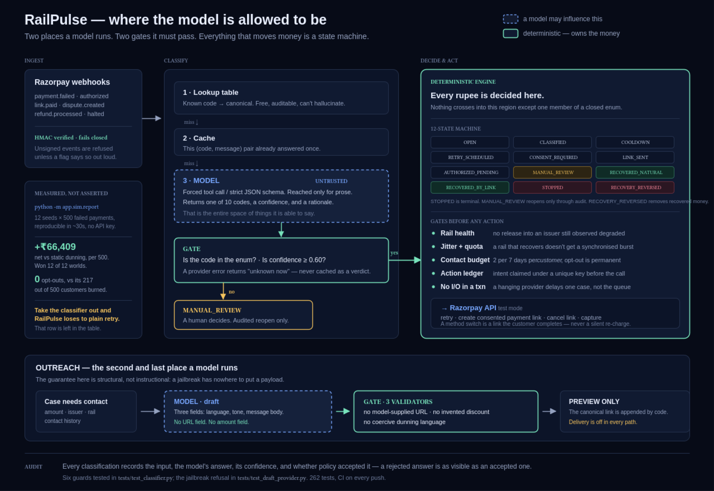

# RailPulse — pitch and demo guide



## The project in one sentence

RailPulse is a consent-aware recovery engine for failed recurring payments. It
reads a failure, decides whether to wait, retry, ask the customer to authorise
a new payment method, stop, or ask a human — and it keeps the model out of the
money-moving decision.

## What actually happens to a failed payment

1. Razorpay sends a signed webhook for a payment failure, a later authorisation
   or capture, a payment-link event, refund, or dispute.
2. RailPulse normalises the event, deduplicates it, and records issuer/rail
   health.
3. A known failure code is mapped by lookup. For unfamiliar issuer prose, an
   optional LLM may return only one of ten fixed codes and a confidence. An
   unknown, low-confidence, malformed, or unavailable answer becomes
   `MANUAL_REVIEW`; it never becomes a speculative retry.
4. A deterministic state machine decides the action. Temporary bank problems
   wait for rail health; a dead card or cancelled mandate receives a consented
   Razorpay payment link; fraud, disputes, opt-outs, and exhausted contact
   budgets stop automation.
5. Every customer has a two-contact-per-seven-days budget and a 24-hour
   cooldown. The budget is per person, not per invoice.
6. Each external action is claimed in a durable ledger before the gateway call.
   If the original payment later captures, RailPulse cancels the outstanding
   payment link so there is no second collection.
7. The only other LLM surface is a *preview-only* outreach draft. It has no
   URL or amount field; deterministic validators reject a model-supplied link,
   discount, or coercive language. RailPulse never sends SMS or WhatsApp.

## The important distinction

This is not an "AI decides who to charge" project. The model is deliberately
small and boxed in:

| Model may do | Model cannot do |
| --- | --- |
| Normalise unfamiliar issuer prose into one of ten codes | Invent a recovery action, retry time, payment rail, or state |
| Draft preview-only customer copy | Supply a payment URL, amount, discount, recipient, or delivery request |
| Return a confidence and rationale | Override customer consent, contact limits, fraud stops, or the state machine |

That is the key panelist story: AI adds language understanding where rules are
brittle; deterministic policy still owns every rupee.

## What is measured, and the honest way to say it

The simulator runs 500 failed payments across 12 identical seeded worlds for
each policy. In the default synthetic world, RailPulse with classification
recovers a mean **₹66,409 more than static dunning per 500 payments** (95% CI
₹43,757–₹89,061), wins all 12 paired worlds, and records **0 opt-outs** versus
static dunning's mean 216.9. It also beats retry-with-backoff by ₹74,923 in
that world.

Say this exactly: **"These are controlled synthetic-world comparisons, not a
forecast of a merchant's live revenue."** The benchmark deliberately keeps the
model-free version too: without classification, RailPulse loses to ordinary
retry-with-backoff. That ablation makes the classifier's contribution visible
instead of treating "AI" as decoration.

With no API key, the local run visibly uses the keyword floor, not an LLM. Add
an OpenAI or Anthropic key only when you want to demonstrate the real
structured-output classifier and drafter.

## Panelist checklist

A panelist should be able to answer these five questions in the first minute:

1. **Why is this a real merchant problem?** Blind retries waste money and
   aggressive dunning burns customers.
2. **What is genuinely different?** The model classifies language; the state
   machine makes payment decisions. No unbounded model output can move money.
3. **What keeps it safe?** Consent-only method switching, issuer-health
   cooldown, customer contact budget, idempotency ledger, link cancellation,
   and manual review.
4. **What evidence supports it?** Paired, multi-seed baselines; confidence
   intervals; an ablation; an explicit synthetic-data limitation.
5. **Can I see a hard case, not just a happy path?** Yes: a late original
   authorisation cancels the recovery link, and a malicious outreach draft is
   blocked on screen.

## What to show in the video

Do not walk through every dashboard tab. Show one short failure story and one
safety failure:

1. Start on the dashboard and say the one-sentence thesis.
2. Show the architecture image for 10–15 seconds. Point at the two blue model
   boxes and the green deterministic engine.
3. Click **Run late-authorisation demo**. Narrate: failed card → consented
   link → original payment authorises → link is revoked → original capture is
   recovered naturally. Open the action trail if needed.
4. Click **Try a non-compliant draft**. The screen shows that a fake URL,
   discount, and threat were rejected and that no message was sent.
5. End on the benchmark result and its limitation, not a generic dashboard
   claim.

## Three-minute video script

### 0:00–0:20 — hook

"A failed recurring payment is not one problem. A temporary bank outage may
clear later; an expired card needs a new instrument; a fraud block should never
be chased. Most recovery systems either retry everything or let an AI make an
unbounded decision. Both are risky around money."

### 0:20–0:40 — thesis

"We built RailPulse: a containment layer for letting a model near money. The
model only normalises messy issuer language into a fixed failure code. The
deterministic state machine makes every recovery decision."

### 0:40–1:05 — architecture

Show the architecture image.

"Razorpay webhooks enter through signature verification and idempotency. Known
codes use a lookup; unfamiliar prose can reach a structured-output model, but
only one of ten codes can cross the boundary. Low confidence, bad output, or an
outage goes to manual review — never to a retry."

### 1:05–1:40 — decision policy

"The engine checks issuer health, jitter and release quotas, a per-customer
contact budget, and a durable action ledger. A dead card gets a consented
payment link, never a silent method switch. Risk, disputes, and opt-outs stop
automation. Network calls happen outside the database transaction."

### 1:40–2:10 — live demo

Click **Run late-authorisation demo**.

"Here a card fails, so RailPulse creates one consented recovery link. Then the
original mandate authorises late. Before it captures, RailPulse cancels the
live link — so the customer cannot pay twice. The audit trail records both
actions."

### 2:10–2:30 — prove the guardrail

Click **Try a non-compliant draft**.

"The model can draft copy, but it cannot send it. This deliberately unsafe
draft contains a URL, a discount, and a threat. Policy blocks all three; no
message is delivered. That is a structural control, not a prompt request."

### 2:30–2:55 — evidence, stated honestly

"Across 12 paired synthetic worlds of 500 failed payments, RailPulse recovered
₹66,409 more per world than static dunning, with zero opt-outs versus 217. And
we keep the uncomfortable ablation: remove classification and the engine loses
to ordinary retry-with-backoff. These are controlled synthetic comparisons,
not merchant-revenue forecasts."

### 2:55–3:05 — close

"RailPulse does not ask a model to decide who gets charged. It lets AI
understand the ambiguity, while policy, consent, and auditability own the
money."

## Run it locally

From the repository root on macOS/Linux:

```bash
python3 -m venv .venv
source .venv/bin/activate
python -m pip install -e '.[dev]'

# Reproduce the benchmark; no API key is needed.
python -m app.sim.report

# Walk through one payment end-to-end.
python scripts/tour.py

# Re-derive the claims spoken in the video.
python scripts/verify_claims.py

# Verify the implementation.
pytest -q
ruff check app tests

# Open the dashboard at http://127.0.0.1:8000
uvicorn app.api:app --reload
```

Optional real-model mode:

```bash
export OPENAI_API_KEY=...
# Or: export ANTHROPIC_API_KEY=...
python -m app.sim.report
```

Optional Razorpay integration (test keys only):

```bash
RAZORPAY_KEY_ID=rzp_test_... RAZORPAY_KEY_SECRET=... \
  python scripts/verify_razorpay_live.py
```

The dashboard defaults to the in-memory fake Razorpay gateway when those
Razorpay credentials are absent. Never use `RAILPULSE_ALLOW_UNSIGNED_WEBHOOKS=1`
outside local fixture testing.
